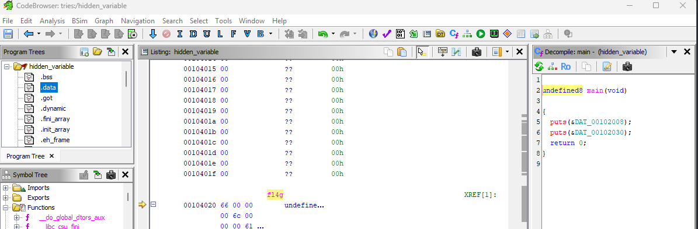

> Non trovo più la mia variable :(, mi daresti una mano?

Aprendo il file dato con Ghidra, una veloce analisi rende possibile scoprire che la flag si trova in `.data` sotto la label `fl4g`:



Dunque basta runnare in cmd (nella dir dove abbiamo il file binario):

```
objdump -d hidden_variable -j .data
```

Ricevendo come risultato:

```
hidden_variable:     file format elf64-x86-64


Disassembly of section .data:

0000000000004000 <__data_start>:
        ...

0000000000004008 <__dso_handle>:
    4008:       08 40 00 00 00 00 00 00 00 00 00 00 00 00 00 00     .@..............
        ...

0000000000004020 <fl4g>:
    4020:       66 00 00 00 6c 00 00 00 61 00 00 00 67 00 00 00     f...l...a...g...
    4030:       7b 00 00 00 75 00 00 00 6e 00 00 00 75 00 00 00     {...u...n...u...
    4040:       35 00 00 00 33 00 00 00 64 00 00 00 5f 00 00 00     5...3...d..._...
    4050:       76 00 00 00 34 00 00 00 72 00 00 00 35 00 00 00     v...4...r...5...
    4060:       5f 00 00 00 34 00 00 00 72 00 00 00 33 00 00 00     _...4...r...3...
    4070:       5f 00 00 00 35 00 00 00 37 00 00 00 31 00 00 00     _...5...7...1...
    4080:       31 00 00 00 5f 00 00 00 63 00 00 00 30 00 00 00     1..._...c...0...
    4090:       6d 00 00 00 70 00 00 00 31 00 00 00 6c 00 00 00     m...p...1...l...
    40a0:       33 00 00 00 64 00 00 00 7d 00 00 00                 3...d...}...
```

Riscritta char per char:

**flag{unu53d_v4r5_4r3_5711_c0mp1l3d}**