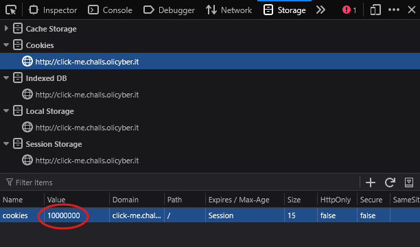

> Ho creato un clicker game, riesci ad arrivare a 10000000 biscotti?

Basta andare nei devtools del browser (F12) e cambiare, nei cookie, il value dei cookies in `10000000`.

Ricaricando, la flag uscirà scritta in chiaro sul sito.