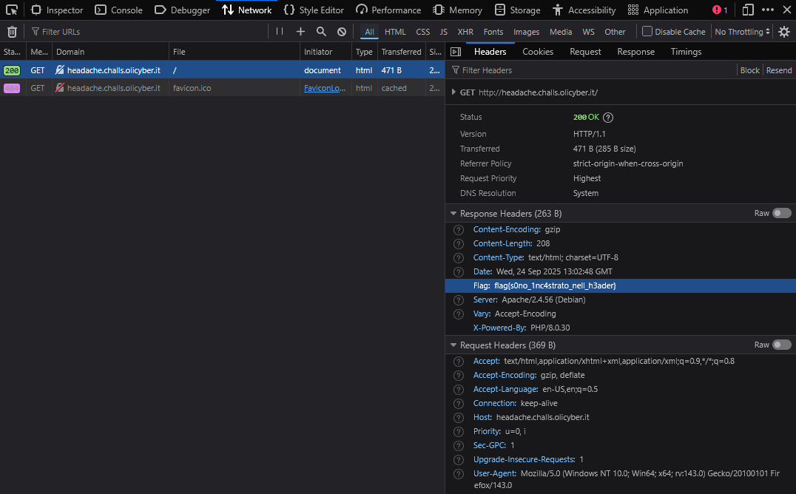

> Quando carichiamo una pagina web stiamo comunicando con un server, ma cosa ci risponde?

Apri gli strumenti per sviluppatori del browser, vai nella sezione "Network", ricarica la pagina e osserva gli header della richiesta GET.

