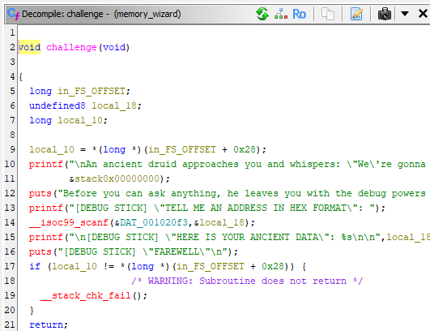

> You never know who you get to encounter along the way... but you can still predict it.
> This is a remote challenge, you can connect with: nc memorywizard.challs.olicyber.it 21001

Siamo dotati di una connessione TCP e un file .zip. Usando il tool di [Ghidra](https://github.com/NationalSecurityAgency/ghidra) o un qualsiasi disassembler, analizzo il file ricevuto. Dal codice si vede che il programma mostra l'indirizzo del primo elemento dello stack e poi chiede all'utente di inserire un indirizzo.

Se si esamina il comportamento con un debugger si scopre che la flag è salvata a un offset di 8 rispetto a quell'indirizzo. Con questa informazione si può risolvere la challenge.

**ptm{n34r3r_7h4n_3xp3c73d}**