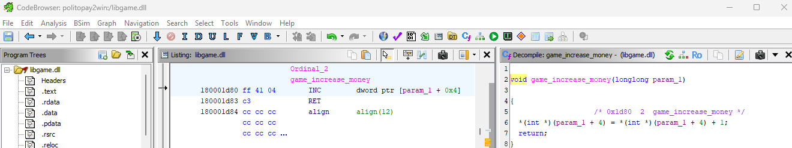

> PoliTO can be quite challenging. To pass this exam session, you'll need to earn a significant number of ECTS. Do you think you can manage to do it?

Ci vengono forniti due archivi, uno per Linux e uno per Windows: `game-linux.zip` e `game-windows.zip`.
Esaminando la libreria .dll o .so con un disassembler, si individua una funzione che incrementa il saldo di gioco senza effettuare verifiche aggiuntive.
Modificando il segno della variabile che rappresenta i soldi, otteniamo una quantità enorme di denaro (dato che il valore unsigned corrisponde a -1). A questo punto, acquistando l'oggetto "unknown" nel market, si ottiene la flag.

**ptm{p4tch1ng_3xecut4bl3s_1s_fun}**

*P.S. io ho usato Ghidra*